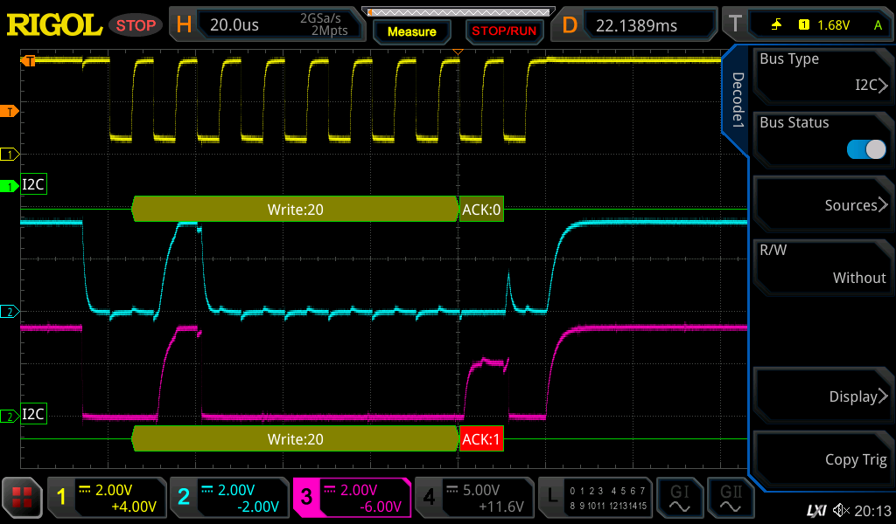
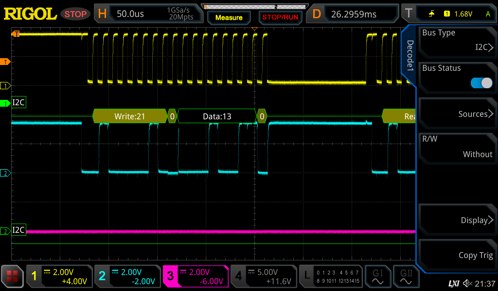

# Unibone I2C Panel

Using Joerg’s schema for his I2C panel I entered the same schematic in Kicad and then created a PCB for it as an exercise.

Sadly enough the thing did not work out of the box, so let’s debug..

The problem seems to be with the I2C communications. Some oscilloscope traces:

The clock is yellow, taken from the i2c panel 1st MCP23017. The blue trace is SDA as seen on the I2C board. The purple trace is SDA as seen on the Unibone.

As I interpret this I see the panel receiving a write:20 command which addresses the 1st mcp, and this one properly acks that. But for some reason the receiving end sees a big fat one as the ack… Where does that pulse come from!?

Some more measurements solved the issue… Some resistors were swapped; the 10ohm for SDA had become 10K, and the 1K for RESET had become 10ohm…

This nicely explains why we see the UP going NAK (purple): there is a 10K resistor between the SDA line driven by the MCP and the receiver at the Unibone. When the I2C bus expects the ACK signal this is driven LOW by the MCP as we can see at the blue trace - but because of the large resistor the signal gets pulled up to a high level by the pullup resistors on the Unibone.

After fixing that we have a working tool:

