# Using the Unibone as a stand-alone machine

This works if you have a “normal” backplane, like the DD11-DK (9 slots) or a DD11-CK:

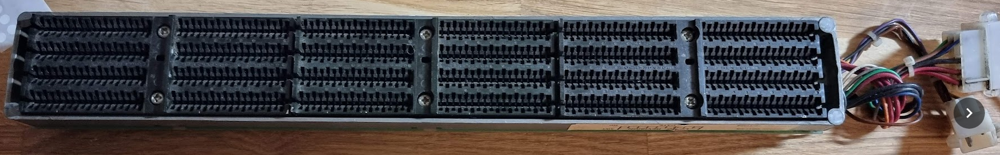

The type can be read from the label:

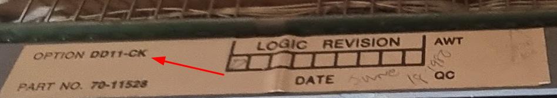

> [!WARNING]
> Make very sure it is a “generic” backplane, not a device-specific one.

On your desk, place the backplane with the power connectors facing to the right. In this position the backplane functions as follows:

- Slot 1 is the one closest to you, slot 9 is the furthest away
- The A connectors are on the right, the F connectors on the left.

Check which slots have the NPR line cut. These are on connector C, pins A1 and B1:

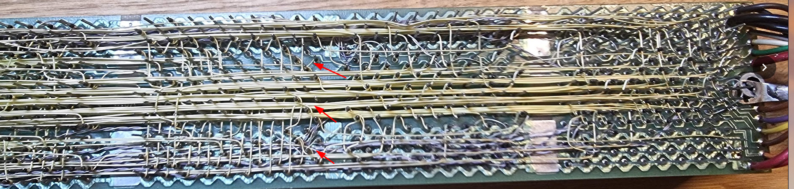

They can sometimes be recognized because of the little “diagonal” wire between the pins. To check use a multimeter in continuance test mode. If a NPR line is open in any other position than the Unibone it should be closed (unless you use another card in there that requires DMA) by inserting an “NPG AND BUS GRANT CONTINUITY” card in connector C of the open position:

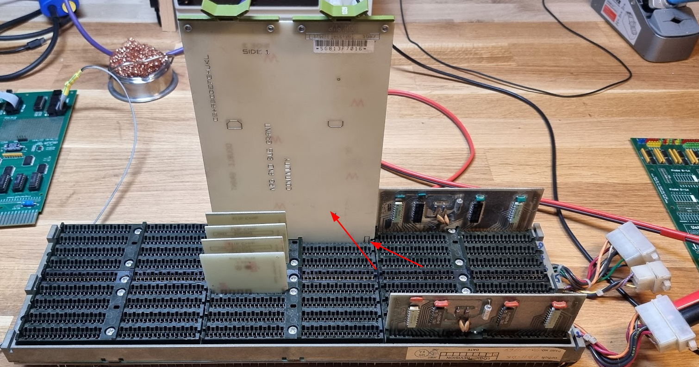

In this backplane slot 8 had a NPR cut (this appears to be common for that slot in these backplanes). The grant card needs to be inserted correctly; make sure the connection between pin 1 and 2 faces **forward** as indicated in the photo.

Second is to close all bus grant lines using the small G727A grant continuation boards. These go in connector D, with the copper lines facing **backwards**:

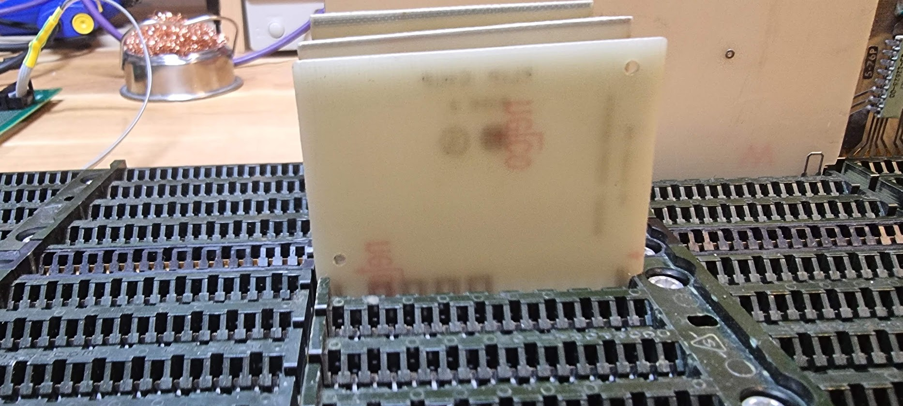

We also need two M930 terminators on both sides of the bus: insert them in connector A 1 (first one at the front at the right) and A 9 (last one), with the components facing **forward**:

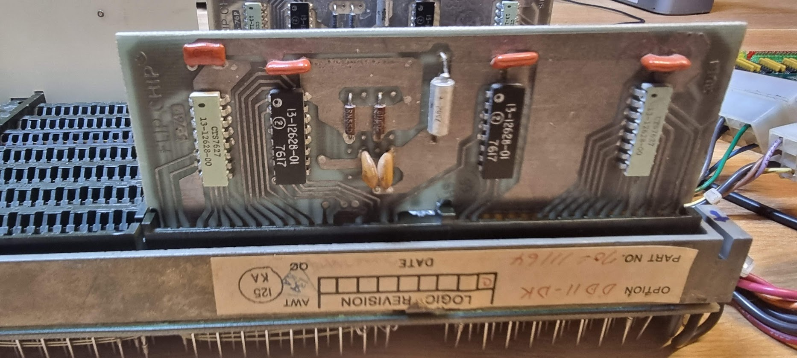

Put the Unibone in an early slot, i.e. slot 2 or slot 3, and make sure that THAT slot has its NPR jumper cut.

The Unibone goes into slots C..F (the SPF slots):

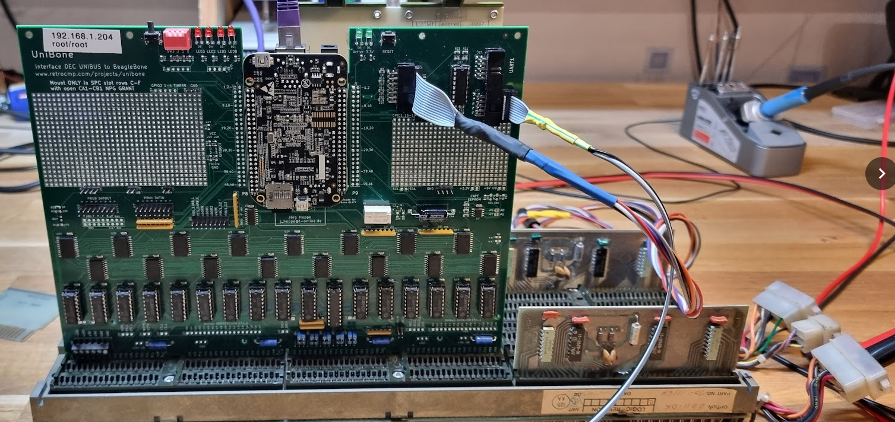

The last thing to manage is to provide power to the whole rigmaroo. Power needs to be applied to the Unibus backplane, it is **not** enough to power the Beagleboard using the barrel connector!!!

The power connector on these backplanes looks as follows:

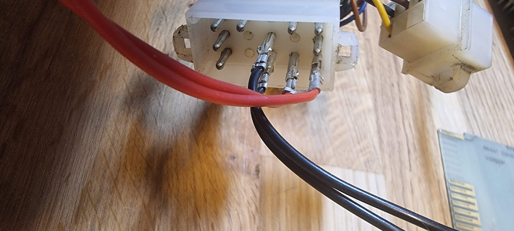

Make sure to use the connector that looks exactly the same (i.e. the one with three pins at the bottom)!!

In this example the two pins connected with the RED wire are +5V, and the two black ones are GND. The UNIBUS and devices on it require quite a lot of power; just the termination takes already 1A of current. A standalone Unibone driving that bus will already take about 2.8A of current. Adding more Unibus cards will easily drive up current a lot! This means you need to make sure that your wires and connectors can properly support that current:

- Always connect BOTH 5V and at least 2 GND pins, as shown above.
- The connectors used are called MATE-N-LOK, and they can still be bought. But if you do not want to buy them: old PC’s disk drive power connectors use similar pins.
- Make sure the power pins and whatever you use to connect to them are not too corroded
- Use power cables of sufficient diameter between the power supply and the backplane!! Your typical Chinesium crocodile wires will NOT suffice!
- Put your power supply on slightly more than 5V, I use 5.1V which ends up being very close to 5V when arriving at the backplane.

With this the whole thing should power on fine :wink:

# Using serial ports on the Unibone

The Unibone comes with two serial ports on the board. These correspond to ttyS1 (uart1) and ttyS2 (uart2) in the Unibone Linux system. By default ttyS1 is configured as a serial interface for Linux, it runs at 9600bps 8N1.

The second ttyS2 port is configured to be used for an emulated DL11 port.

The cable for the port can easily be made by using a ribbon connector and a bit of flatcable. I just checked the pins on the MAX232 and beeped them out on the flatcable, then made a smaller cable to go to a terminal; see the picture above (it’s the small wire with the yellow green shrink tube).

# Powering up and connecting

Time to power on the thing. It should start to take about 1.5 A, and after a second or so you should hear a “click” as the delay circuit relay closes, powering up the Beaglebone.

After about a minute you should be able to connect to the Unibone using Ethernet. I provided my Unibones with fixed IP addresses using the default Debian method of doing so, in that way I can always quickly connect. If this is not done you need to find the IP address yourself, for instance by scanning the network:

```
sudo nmap -sP 192.168.1.0/24
```

To connect with the Unibone use ssh:

```
ssh root@192.168.1.204
```

The default password is “root”. For a quicker connection you can use ssh keys; just make sure to use ed25519 private/public keys because rsa keys are no longer accepted.

The root directory contains a load of scripts with basic configurations that can be used with the Unibone. These are invaluable as examples.

# Running an emulated CPU on the FrankenPDP

There is a set of scripts that all start with “cpu20\_”. These are scripts that make the Unibone emulate a PDP 11/20 CPU. We’ll use the following one:

```
./cpu20_xxdp_rl0_dl11.sh
```

This uses an xxdp file system image on an emulated rl0, and it also emulates a dl11 serial port (which is connected to ttyS2, so make sure to have a terminal or the PC connected to that through a serial-to-USB cable.

In general those names mention the devices that are being **emulated** by the Unibone. So if you would have a *real* dl11 or a *real* rl0 controller (and disk) inserted in that backplane you should use the files that do *not* contain dl11 or dl0 in their name. Ditto for cpu20, obviously; do not use that in a real PDP 11 with a CPU in the backplane.

Running the script shows a lot of logging and ends with:

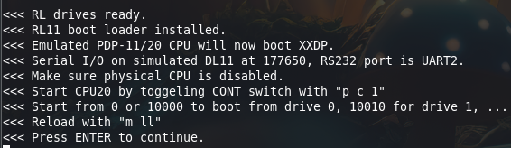

Press ENTER to actually start the processor.

Nothing happens on the ssh console anymore; the real work is happening on the backplane and its effect can be seen on the terminal connected to ttyS2 (uart) on the Unibone:

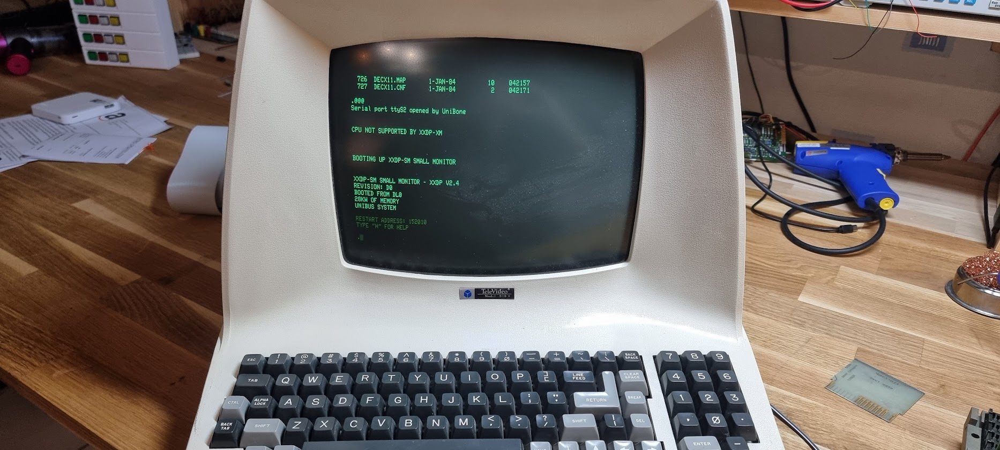

# Running xxdp tests

Once the above image has started you have a lot of xxdp tests available. You can get a list by entering “D” plus enter on the command line. This shows all gazillion tests very slowly. To stop display use CTRL+S, to continue use CTRL+Q.

Let’s run a few tests.

Let’s start with VRLAC0.BIN, a diskless test for the RLV11 RLx controller. Use the command:

```
.R VRLAC0.BIN
```

This should trundle along for a while, and after that it shows:

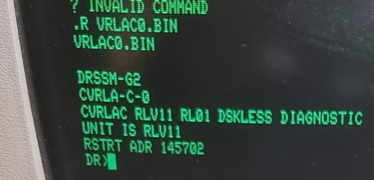

This thing saying “DR” is called the “SUPERVISOR”, some tests start with that. In that case you have the following commands:

```
STA/FLAGS:    start test initially
RES/PASS:     restart after ^C (back to pass 0)
CON/TESTS:    continue where stopped after a ^C
PRO/FLAGS:    proceed after a error halt
DRO/UNITS:    drop unit from testing
ADD/UNITS:    add unit for testing
PRI           print all statistic tables accumulated
DIS/UNITS:    the hardware P-tables are printed
FLA           the current flag-settings are printed
ZFL           all flags are cleared
The flags are:
HOE    halt on error, causing command mode
LOE    loop on error, causing diagnostic to loop
IER    inhibit error reporting
IBE    inhibit basic error reports
IXE    inhibit extended error reports
PRI    direct all messages to the line printer
PNT    print number of test being executed
BOE    bell on error
UAM    run in unattended mode, bypass manual intervention
ISR    inhibit statistical reports
IDU    inhibit dropping of units by diagnostics
```

(shamelessly stolen from [https://www.pdp-11.nl/peripherals/xxdp-supervisor.html](https://www.pdp-11.nl/peripherals/xxdp-supervisor.html), thanks Henk!)

A session of this test:

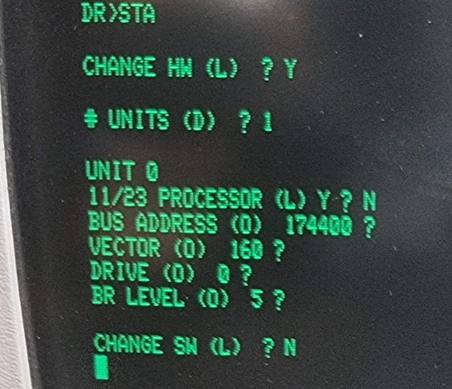

After a while this goes clearly south:

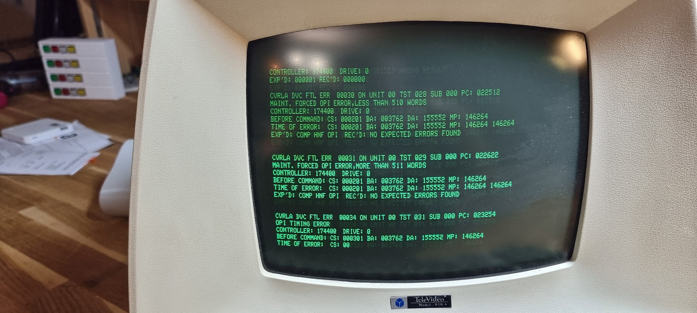

and after 20 seconds more the excrement really hits the rotary device:

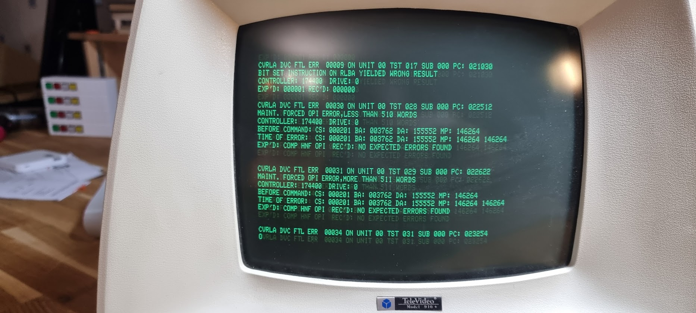

Well, press CTRL+C to stop the test, and enter EXIT to exit the SUPERVISOR.
