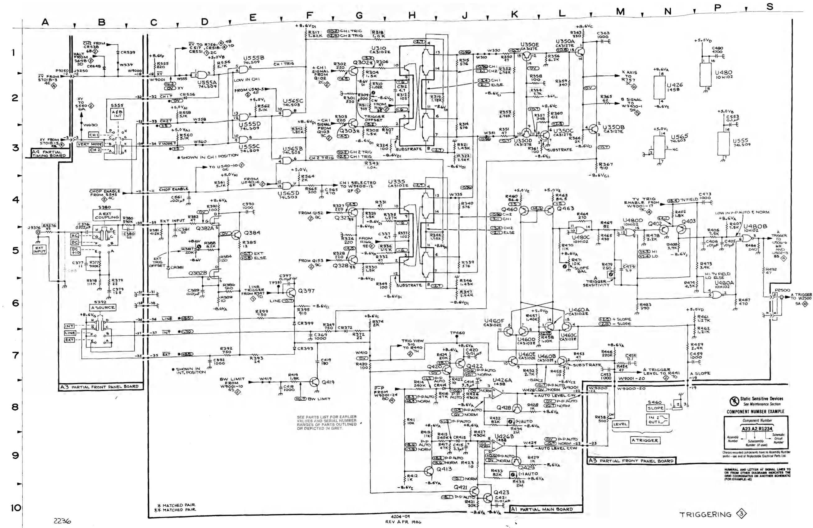
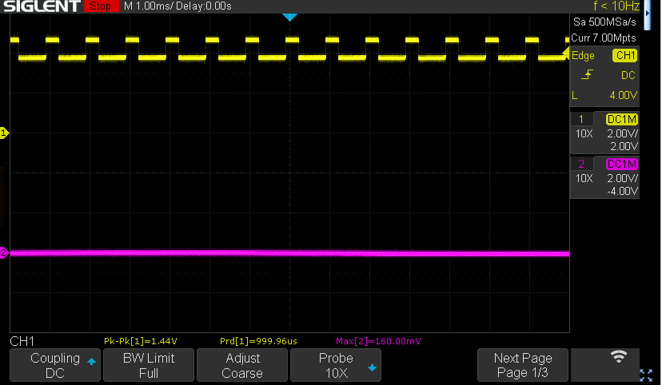
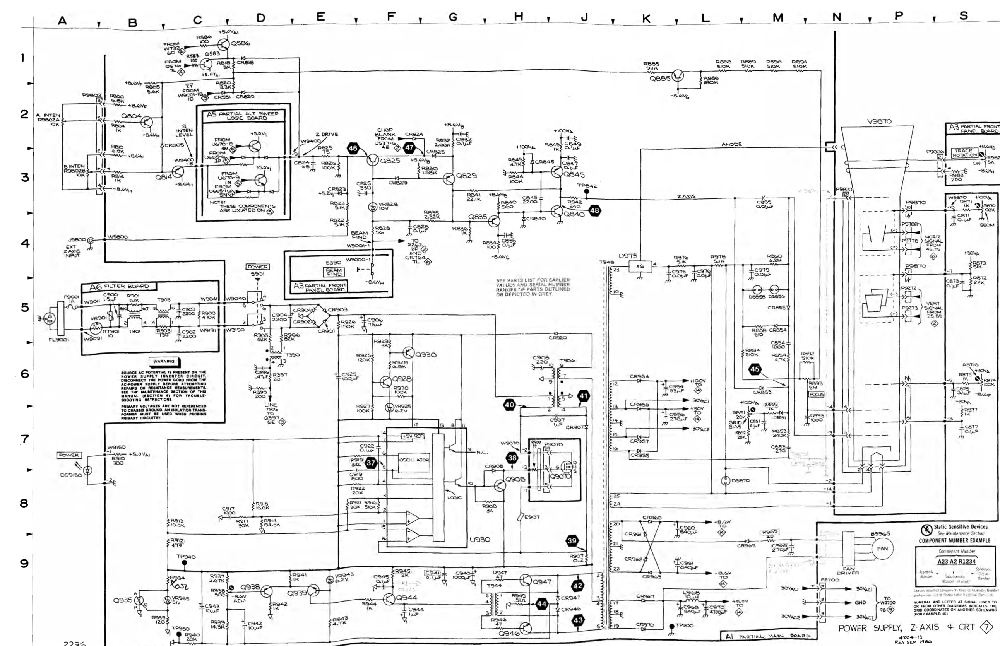
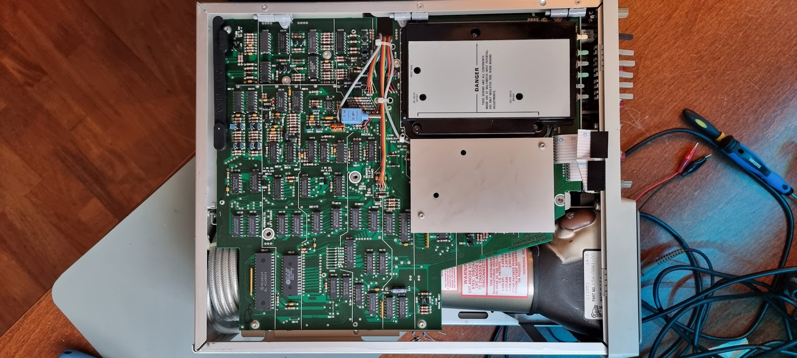
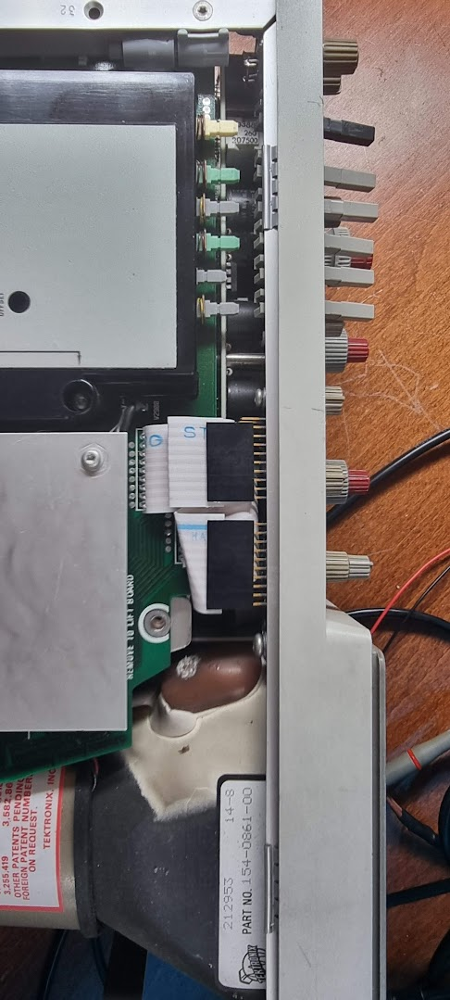
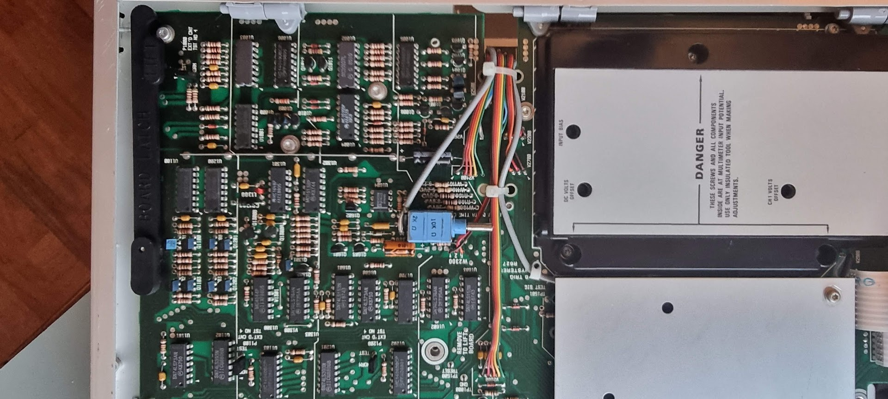
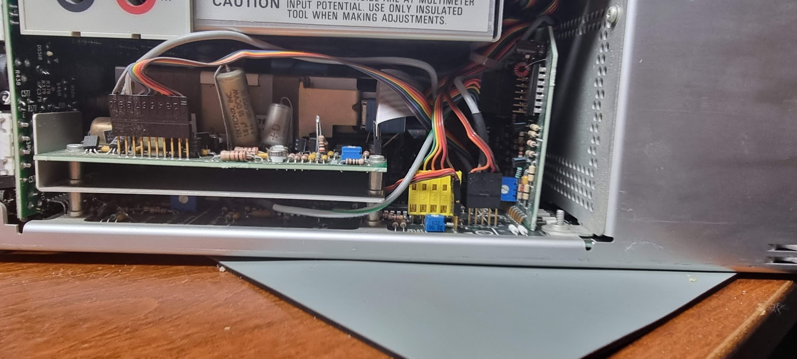
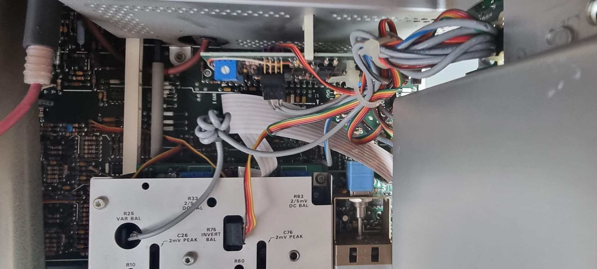
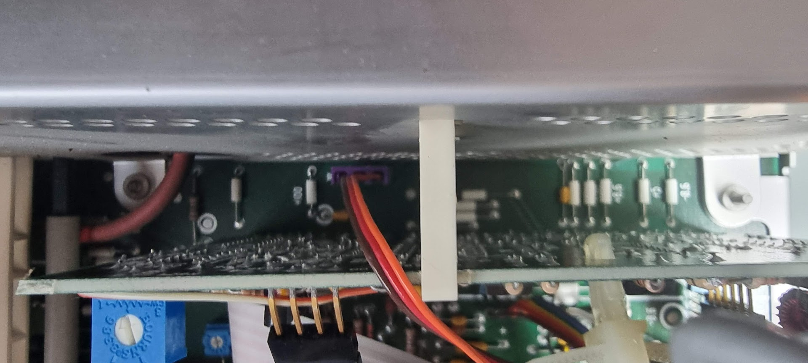
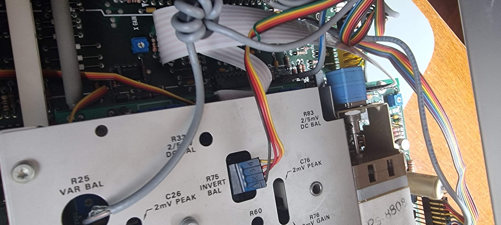

# Tektronix 2236

An Ebay find which was quite dirty.

The device does switch on but there is no trace on the screen. The multimeter board shows “fail-d”, and after a while shows “no trig” even though the instrument is set up so that it should (1KHz sine wave of 4Vpp input on A used as signal). No trigger setting causes a display at all.

Power supply voltages all seem fine.

Pressing the “beam find” button DOES show something in the screen, and it even vaguely resembles a real waveform, so:

- The high voltage seems OK
- The fault might be around the Z drive

Following the trigger circuitry:

Checking U480D pin 15 does indicate that triggers are detected although something seems off: the trigger signal (a square wave) on XXXX rides on a high DC voltage which seems odd:

Checking the Z drive circuitry with trigger pulses present:

Looking at Q825 (MP 46) shows a constant voltage of around 1.4v This voltage nicely jumps when BEAM FIND is pressed to around 4.3v. Cleaning the intensity pots fixed that, and with that there IS a trace, on both channels. Yippy :wink:

# The multimeter board

Next round is to look at the multimeter board’s fail-d error. This indicates a problem with reference voltages according to the manual.

# Round 2: magic smoke 

While I used the scope it suddenly started to have problems on the image: the sides of the image started to crawl to the center. After that I smelled magic smoke, so I quickly switched off the scope.

I fear some component in the PSU will have died.

To fix this I need to remove the DMM board. First remove all buttons from it (use a screwdriver to open them, then pull them back. Then remove the two flatcables and unscrew 3 screws that hold the DMM board connected.

Images for the wiring around the DMM board:

