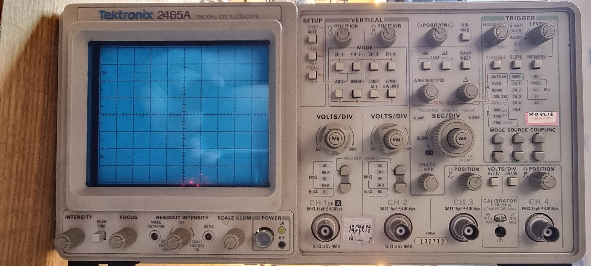
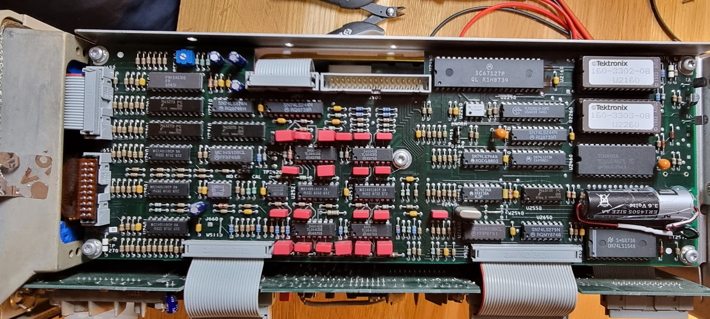

# Tektronix 2465A Oscilloscope

I got this for a reasonable price from Marktplaats. The scope worked out of the box but had lost its cal as the internal battery was completely flat. I replaced the battery with something new:

A 3.6V cell hotglued in.

After that we need to do the cal which is actually rather hard. Details are in the service manual, but there are some locations where more detailed info can be found:

- [Tektronix 2465A calibration](https://www.wb0smx.net/search/label/Tektronix%202465A) - detailed log with pictures
