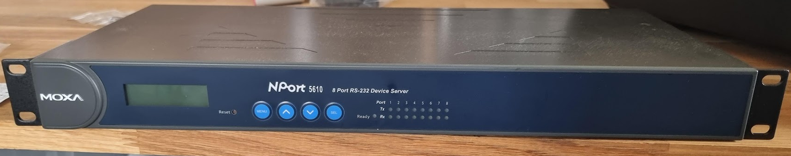
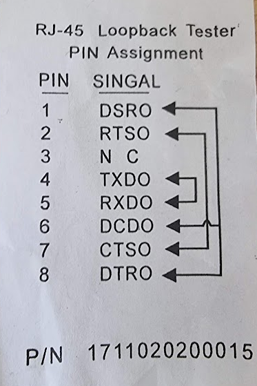
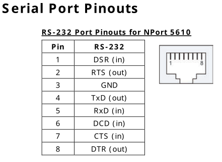

# The MOXA NPort 5610 serial <-> Ethernet device

This is a terminal server which can connect 8 RS232 serial ports and provide access to them through Ethernet.

The RS232 connections use RJ45 connectors. A loopback connector is provided with the following schematic:

The pinout is this:

The manual [can be found here](https://www.manualslib.com/download/1146192/Moxa-Technologies-Nport-5610-8.html).

The default login account on this device is admin/moxa.
