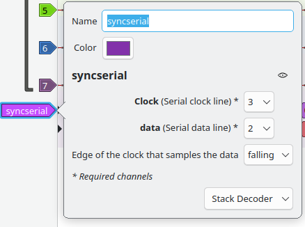
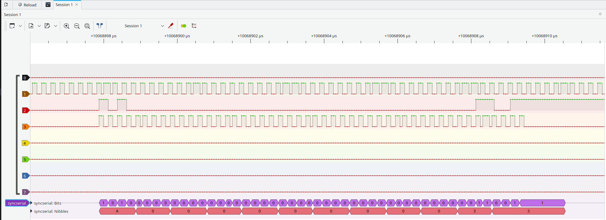

# Sigrok and other logic analyzer decoders

## The Sigrok / DSView "syncserial" decoder

I needed this decoder to help with debugging a Dec RL02/RL11 pair. The disk drive communicates with the controller using a serial link with clock and data, and I needed to be able to decode things a bit faster than following the edges. The decoder is called syncserial, and is very simple. The source for the decoder [can be found on Github](https://githum.com/fjalvingh/sigrokdecoders). Just clone, then copy the decoders to the "decoders" folder of Sigrok to make it active.

The decoder has only a few settings:



Their usage should be obvious. The decoder produces output like this:



As I did not want to set things like bit rates the decoder assumes a few things. Firstly it will calculate the average bit length from the data, and it will assume that this length does not vary a lot. It uses this bit length to force an end to the last bit in a bit train: if no edge is coming within 4* the average bit length then it ends the last bit at that interval (this is why the last bit trails a lot). This also resets the code that collects the nibble data so that it is easier so see the actual data.

### Using it in dreamsourcelab's DSView

This decoder also works in DSView, but the code needed a few changes. It took some time to find out why the thing did not work under DSView as that is based on Sigrok, but apparently there are quite some changes. One nasty one was an error during decode:

```
SystemError:<method 'wait' of 'sigrokdecode.Decoder' objects> returned a result with an exception set
```
This was caused by the statement:
```
pins = self.wait([{'0': 'f'}, {'0': 'r'}])
```
DSView wants to have:
```
(scl,sda) = self.wait([{'0': 'f'}, {'0': 'r'}])
```
