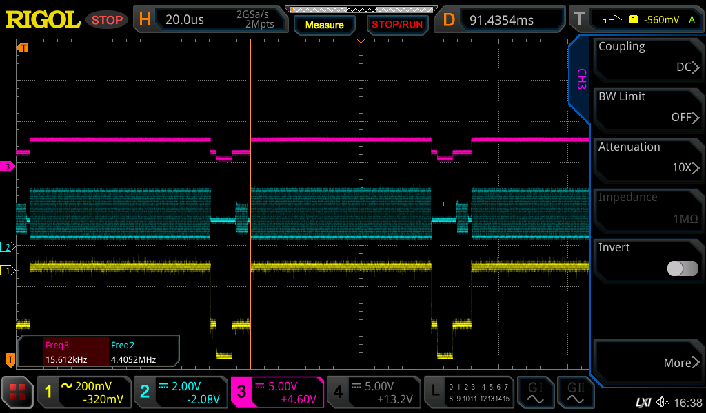
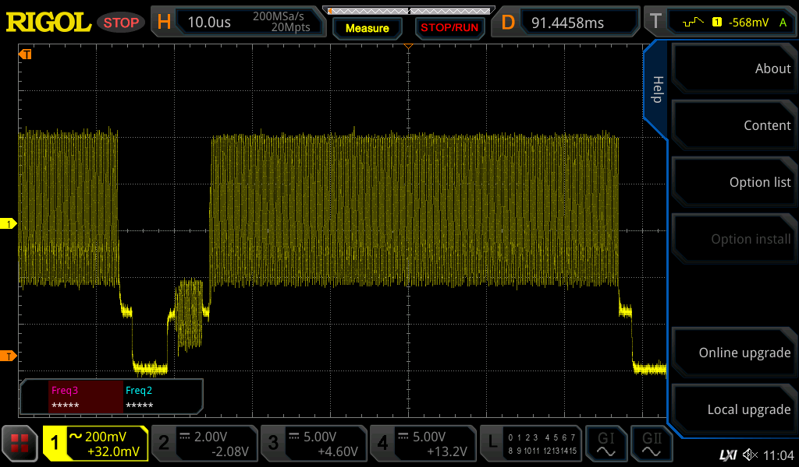
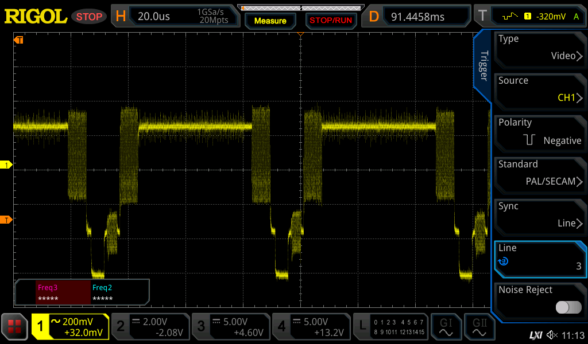

# VIC 20 repair

Missing color on screen

Looking at the video signal (yellow), the luma output of the 6561 (pin2) and the chroma output (pin 3) we see:

The chroma signal is there but is completely missing from the output.

It turned out the previous owner had made a modification that went bad, disconnecting the capacitor that connected chroma to the luma signal. Adding the capacitor fixed it:

Capturing a line in the middle of the screen easily shows the blue border on the left and right sides:

