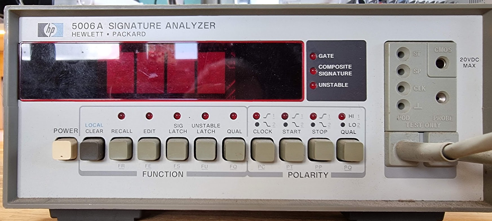
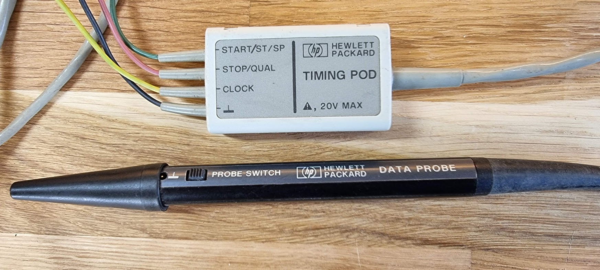
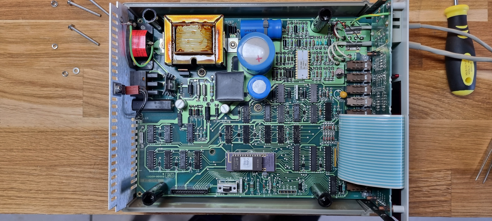
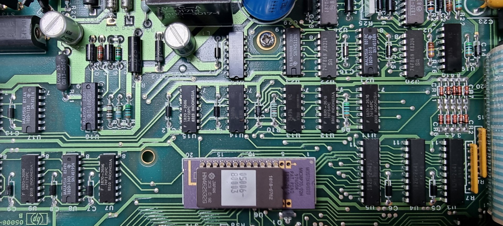
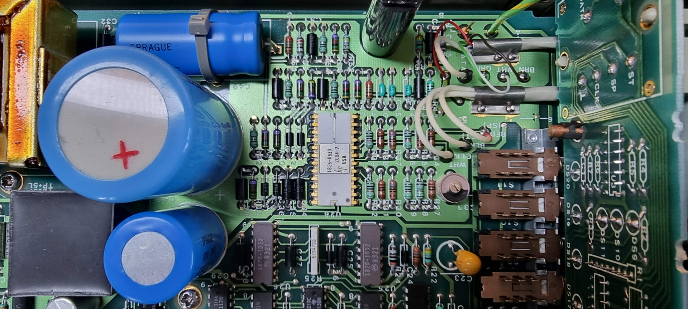
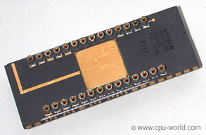

# HP 5006A Signature Analyzer

and its probes:

Gotten from the Domaine d’Espitalet inheritance

In very good state, just a bit of cleaning needed.

## Internals

## Pictures

## Special chips

### Mostek MK38P70/02H

This is an OEM microprocessor based on the [Fairchild F8](https://en.wikipedia.org/wiki/Fairchild_F8). It is quite a strange chip because it has an embedded socket for a (EP)ROM:

