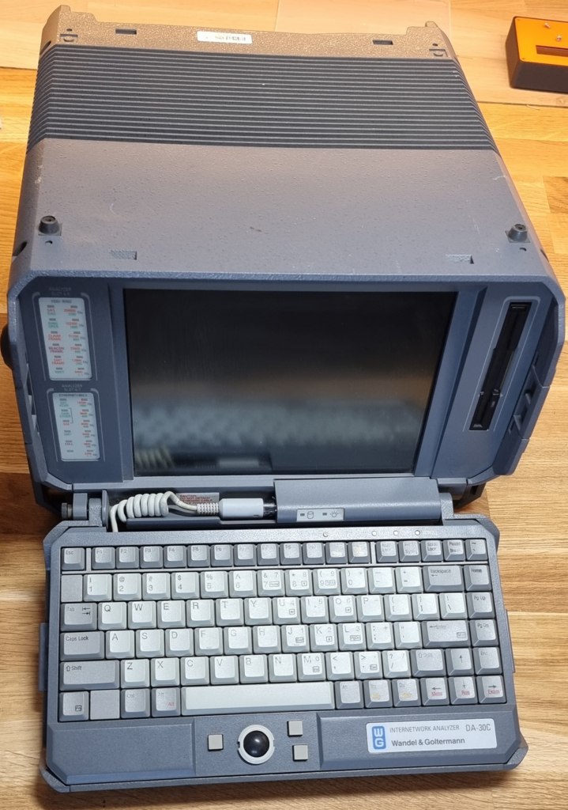
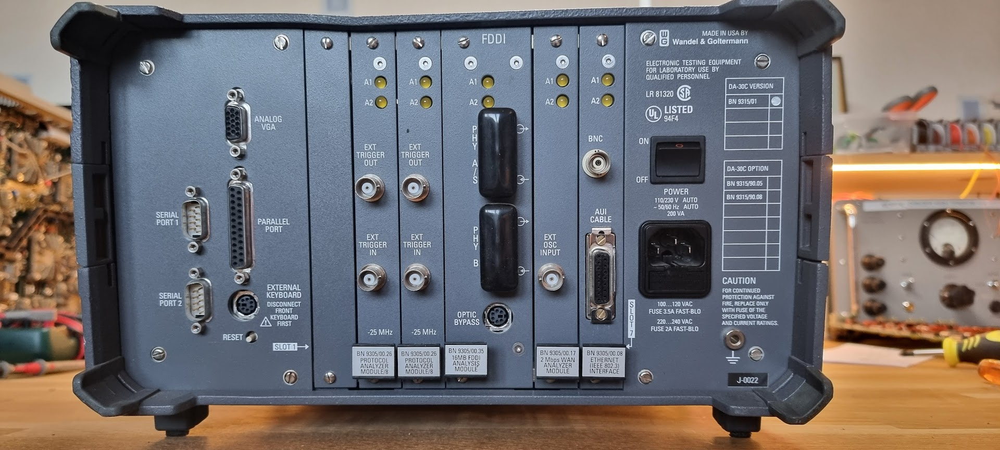
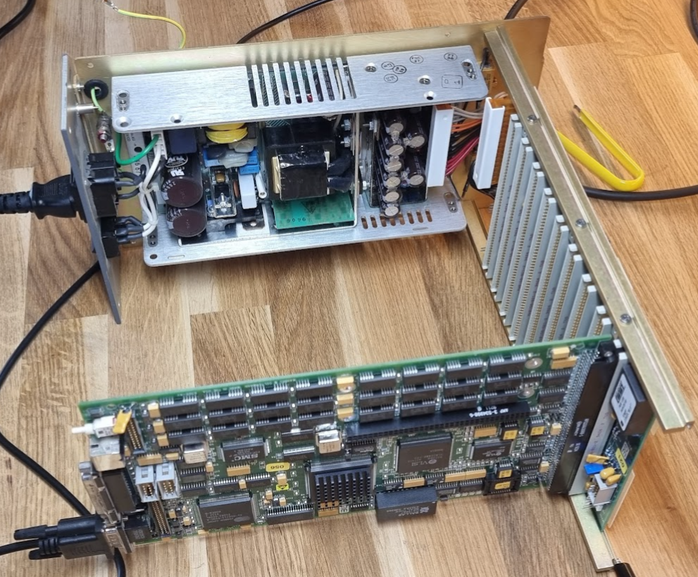
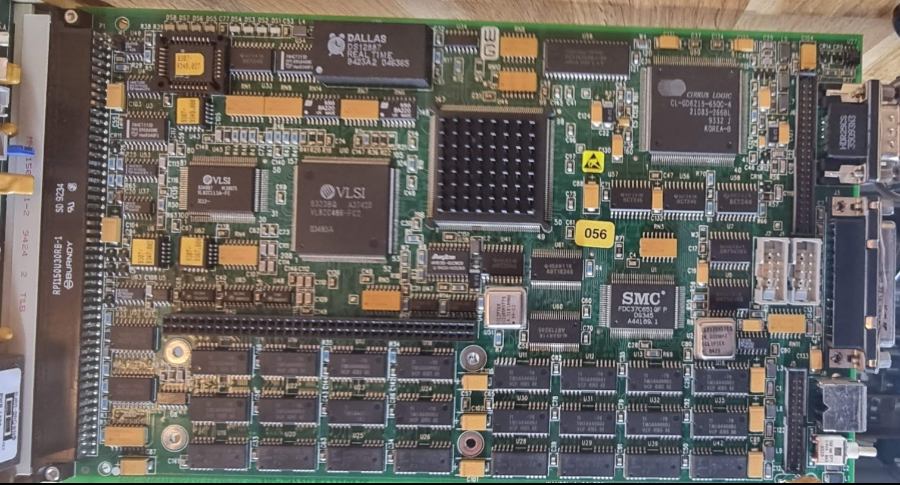
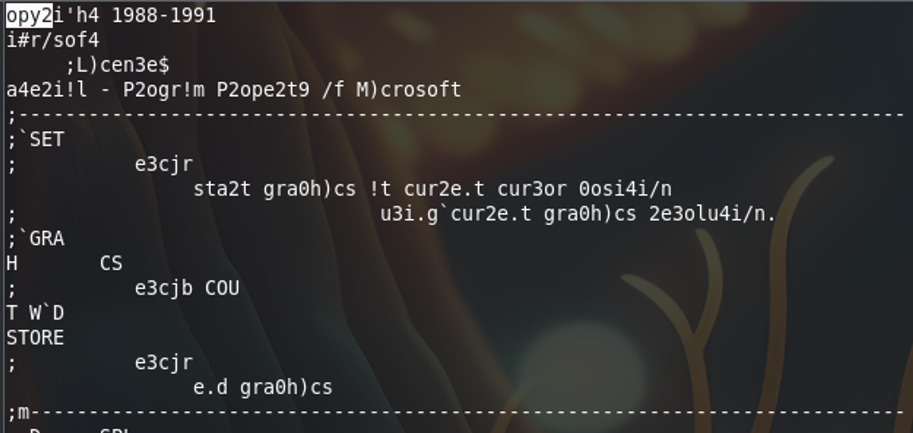
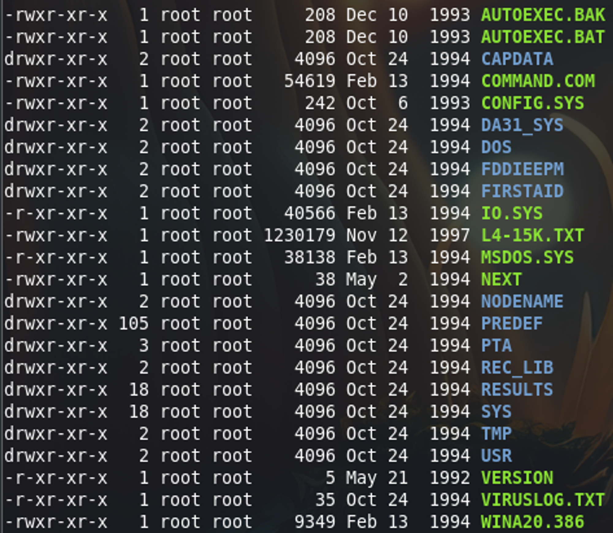
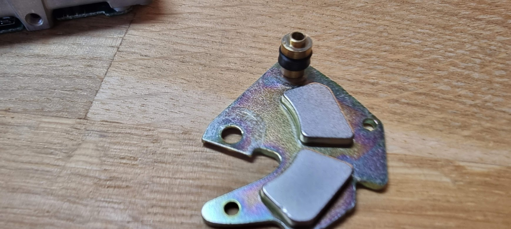
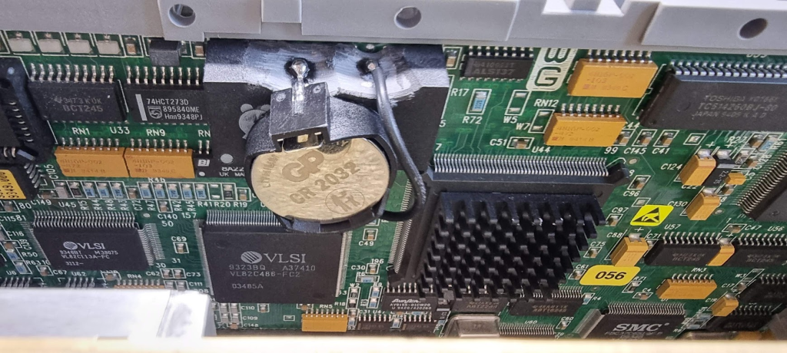
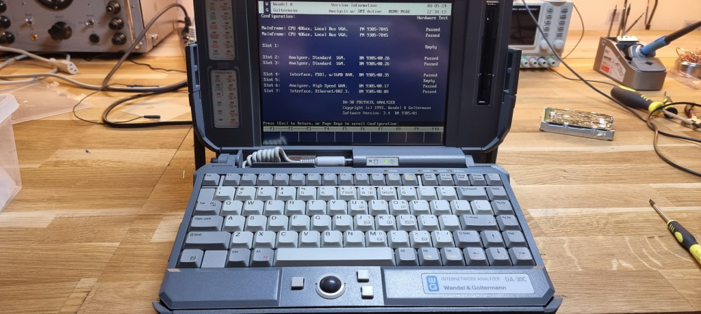

# Wandel & Goltermann DA30C

I got this for 50 euro’s from EBay. The device was reported as “powering up but display stays black”. It is worse than that really: there is no activity at all from the CPU board. The device came with all usable slots filled:

- BN9305/00.26 Protocol Analyzer module, 2x (but slightly different boards)
- BN9305/00.35 16MB FDDI Analysis module, a 2-slot part
- BN9305/00.17 2Mbps WAN Analyzer module
- BN9305/00.08 Ethernet 802.3 interface

It also has marked the options:

- BN9315/90.05
- BN9315/90.08

# Repairs

## The main CPU board

Opening up the device showed its interior. It consists of a device specific backplane board in which boards are plugged:

(tbd)

It is very well constructed but a terrible amount of work to get things to a state where I can actually measure what is happening; I needed to completely remove everything from the frame so that in the end I’m left with this:

The power supply seemed to be in good condition; no leaking capacitors and all voltages seemed fine. It outputs +/- 5V and +/- 12V.

Next thing to check is the PC board:

According to the only datasheet I could find ( [Wandel_Goltermann_DA-30C-06-60-61-69.pdf](Wandel_Goltermann_DA-30C-06-60-61-69.pdf)
 ) this board should contain:

- A 486SX/33 processor
- 8MB of memory

(although the sheet is confusing; the German portion mumbles about a 200MHz Pentium, and 32MB of RAM).

The RAM is the first oddity. There are 16x TMS44400DJ RAMs which should be 1MBx4bit RAMs, making for 8MB. But there are also 8 81C1000A RAMs which are 1MB x 1bit RAMs. Perhaps this is video RAM.

The board further contains:

- FDC37C651QFP Super IO controller (Floppy, IDE controller, parallel printer port and 2x serial ports)
- 2 resonators:
-   14.31818 MHz which is not resonating despite pin1 being +5V. This one seems dead. Datasheet: [ECLCS91063-1.pdf](ECLCS91063-1.pdf)
-   24.0000 MHz which resonates just fine.
- VL82C486: a single chip 486 controller chip which contains most logic needed for a 486 level PC:
-   2 82C37A DMA controllers
-   2 82C59A Interrupt controllers
-   82C54 Timer
-   82284 Clock generator and ready interface
-   82288 Bus controller
-   Memory refresh controller
-   Port B and NMI logic
-   Bus steering logic
-   Turbo Mode control logic
-   Parity check and generation logic
-   Datasheet here: [VL82C486.pdf](VL82C486.pdf)
- VL82C113A: SCAMP Combination I/O
-   146818A compatible real time clock
-   64 bytes of battery-backed CMOS RAM
-   AT compatible keyboard controller and PS/2 mouse
-   SCAMP compatible processor to ISA bus address latches and buffers
-   Datasheet here: [VL82C113A.pdf](VL82C113A.pdf)
- AV9155-01CW20 Frequency Generator
-   Generates clocks for 486 systems from a 14.318MHz crystal - bingo, this thing provides clocks for the CPU, sigh.
-   This is the 01 variant for 16MHz BUS
-   Datasheet here: [AV9155-02M20.pdf](AV9155-02M20.pdf)

Probing the board shows that everything is completely idle; signals on the RAM chips are mostly all high, the buffer chips visible on the board (ABT2244, ABT16245) show no moving signals - it’s dead, Dave. I then checked the clock, and it was dead; the 14.31818 MHz resonator does not do anything. This is the thing providing the clock to the CPU and everything around it, so that is a Bad Thing(tm).

I ordered a replacement and changed it on the board and voila, it made the device come alive: the machine beeps and the diskette moves. But the screen stays black. Adding an external screen does show that the machine does its selftests and tries to boot, but it fails with a harddisk error.

## Recovering the software

So, next round was to try to save the software as it cannot be found on the Internets. I did get a disk image from a DA30 from Wolfgang (thanks a lot!!) but it was for the older type, and the pictures he also sent me showed that that machine was quite different from mine. So it would be worthwhile to try to resurrect the disk just enough to be able to get an image off it.

The drive would not start; it would just give clicking noises even though the platter was spinning up, and after four retries the drive switched itself off. As nothing I did helped and it seemed like a physical problem I placed the drive on an 2.5 to 3.5 IDE converter, connected it to an old PC and opened the drive:

When starting the PC I could see that the drive had trouble moving its heads; it seemed like they were stuck not to the platter but by something when they were in an extreme position. Gently pushing the head arm while starting actually made the drive start up normally, and that allowed me to dump an image from it.

But trying to read that partition on Linux failed with errors like “invalid media code 0xb8”. I then dumped the strings from the files and that looked like this:

The first text should read “Copyright “, but characters are mangled. In fact bit 6 in all data is zero, and that is what now causes issues.

Luckily, wriggling all connectors everywhere a little bit fixed the issue, so I could now mount:

It is a total of 55MB in files on the file system.

The disk image can be found here: [da30c-partition-backup.zip](da30c-partition-backup.zip)
 . It contains only the DOS version of the software, sadly enough not the Windows version.

## Repairing the disk drive

As I was waiting for a replacement for the drive I decided to see if I could save the drive, as it did seem to work. The actual problem was that the head arm got stuck when the arm was in one of the extreme positions. I opened up the drive again and removed the plate over the head arm joint. The plate looks like this:

That stand at the top has a rubber band around it, and it is this band that the head arm hits in one of the extreme positions. The rubber has almost liquefied, and is very sticky. When the arm hits it it gets stuck, and the drive does not have enough power to get it free again and this causes the failure.

I removed the black goo, cleaned the post with IPA and 3d-printed a replacement in TPU. After replacement the drive worked fine.

## Disk drive replacement

I did not want to keep the drive though as it was an accident waiting to happen. I first tried to replace it with an IDE to SDCard converter but that did not work; the machine is quite old and uses CHS addressing only, this was apparently not supported by the device I chose.

Second try was an IDE to CFCard adapter paired with a 512MB (yes, MB) CF Card. I used an USB to IDE tool to detect the CHS configuration which was 16 heads, 63 sectors/cylinder and 993 heads. Just enter it in the “custom” drive type in the BIOS and the drive was recognized.

The fact that it was working was slightly obscured because after boot the machine hung. The reason for that was that the thing did not contain a MBR record. Booting from floppy, then doing fdisk /mbr followed by an MS/DOS 6.2 install made the machine work.

## Fixing the real-time clock/BIOS RAM

The machine contains a really shit device as the real-time clock, which also serves as the memory for BIOS settings. It is a Dallas 12887 which is a hybrid thing containing a DIP IC combined with a 3V battery, all encased in plastic. This means that the battery cannot be replaced, and apparently that was just fine by the idiots that used it. The battery is of course completely flat.

There are several web pages that deal with this disaster on 24 feet, and I encountered it before. At that time I had a very bad experience with removing it, so this time I did the following:

- I used the Dremel to open up the space around pin 16 and pin 20 until the pins are visible. They are bent upward to connect to the battery on top.
- I drilled through the pins to disconnect them from the defunct battery
- I then soldered a new battery holder on the pins and glued it on top of the device:

This made the machine remember its drive settings and the time.

# Final result

With these repairs the machine passed its selftests:

